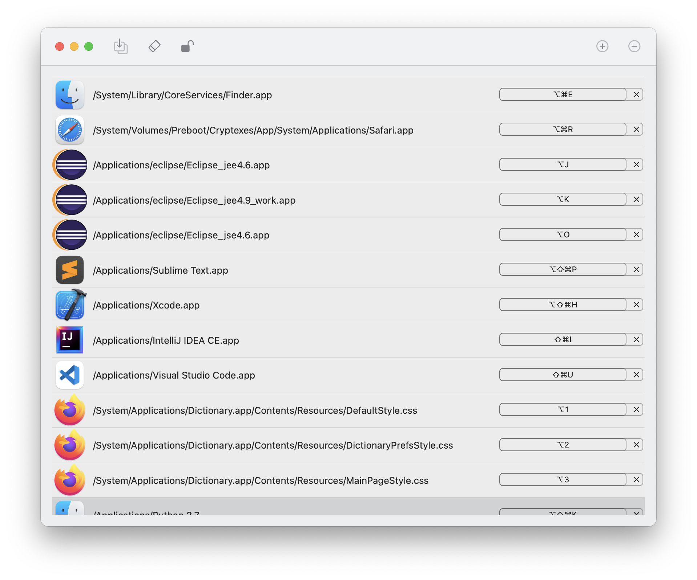

# Switch Shortcut Key

Switch Shortcut Key allows you to use shortcut keys to quickly switch apps and files.

### Features:
- **Multiple App Support:** Can handle multiple apps with the same name, provided they are in different paths.
- **File Shortcuts:** 
  - Set up shortcuts for frequently used files like A.png and B.png. 
  - Assign ⌥A and ⌥B as shortcuts.
  - Triggering these shortcuts opens the files with the system's default 'Preview.app'.
  - Option to change the 'Open With' setting to open files with a different application.
  - Easily switch between files A.png and B.png using ⌥A and ⌥B.

### Screenshots:

## License
### The MIT License (MIT)

Copyright (c) 2023 gangtaoyu

Permission is granted, free of charge, to any person obtaining a copy of this software and associated documentation files (the "Software"), to use the Software without restriction, including without limitation the rights to use, copy, modify, merge, publish, distribute, sublicense, and/or sell copies of the Software, and to permit persons to whom the Software is furnished to do so, subject to the following conditions:

- The above copyright notice and this permission notice shall be included in all copies or substantial portions of the Software.

THE SOFTWARE IS PROVIDED "AS IS", WITHOUT WARRANTY OF ANY KIND, EXPRESS OR IMPLIED, INCLUDING BUT NOT LIMITED TO THE WARRANTIES OF MERCHANTABILITY, FITNESS FOR A PARTICULAR PURPOSE AND NONINFRINGEMENT. IN NO EVENT SHALL THE AUTHORS OR COPYRIGHT HOLDERS BE LIABLE FOR ANY CLAIM, DAMAGES OR OTHER LIABILITY, WHETHER IN AN ACTION OF CONTRACT, TORT OR OTHERWISE, ARISING FROM, OUT OF OR IN CONNECTION WITH THE SOFTWARE OR THE USE OR OTHER DEALINGS IN THE SOFTWARE.
